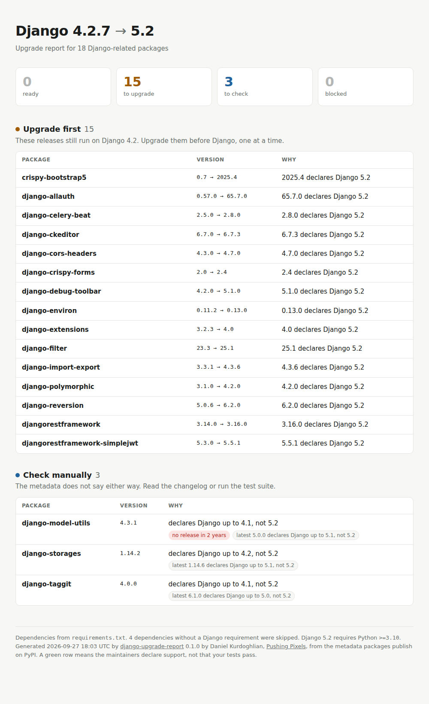

# django-upgrade-report

**Which of your dependencies block a Django upgrade, and in which order to upgrade them.**

[django-upgrade](https://github.com/adamchainz/django-upgrade) rewrites *your* code for a new Django version. This tool answers the question that comes before it: are the 20 to 200 packages your project depends on ready, and what is the smallest step for each one?

```console
$ uvx django-upgrade-report
```

<picture>
  <source media="(prefers-color-scheme: dark)" srcset="docs/report-dark.png">
  
</picture>

It reads your lockfile, asks PyPI what every Django-related package declares, and sorts them into:

| | |
| --- | --- |
| **Blocked** | Even the newest release excludes the target, e.g. `Django<6.1`. |
| **Upgrade first** | A newer release supports the target *and* still runs on your current Django. Do these one by one, before you touch Django. |
| **Upgrade together with Django** | The release that supports the target has dropped your current Django. Bump it in the same change. |
| **Check manually** | Nothing excludes the target, but nothing declares it either. Usually a maintainer who forgot the classifier. |
| **Ready** | The version you use already declares support. |

For every upgrade it names the **smallest** release that declares support, not just the latest, so each step stays as small as possible.

## Usage

```console
$ uvx django-upgrade-report                     # current directory, latest LTS
$ uvx django-upgrade-report path/to/project -t 6.0
$ uvx django-upgrade-report -f html -o upgrade.html
$ uvx django-upgrade-report --python .venv/bin/python   # exact installed versions
```

`pipx run django-upgrade-report` or `pip install django-upgrade-report` work too.

```text
Django 4.2.7 → 5.2
from requirements.txt · 18 Django-related packages

Upgrade first (15)
  These releases still run on Django 4.2. Upgrade them before Django, one at a time.
  ↑ django-allauth         0.57.0 → 65.7.0  65.7.0 declares Django 5.2
  ↑ django-debug-toolbar   4.2.0 → 5.1.0    5.1.0 declares Django 5.2
  ↑ djangorestframework    3.14.0 → 3.16.0  3.16.0 declares Django 5.2
  ...

Check manually (3)
  The metadata does not say either way. Read the changelog or run the test suite.
  ? django-model-utils  4.3.1   declares Django up to 4.1, not 5.2; no release in 2 years
  ? django-storages     1.14.2  declares Django up to 4.2, not 5.2
  ...

Django 5.2 requires Python >=3.10
0 ready · 15 to upgrade · 3 to check · 0 blocked
```

| Option | |
| --- | --- |
| `-t`, `--target` | `lts` (default, the newest x.2 release), `latest`, or a version like `5.2` |
| `-f`, `--format` | `text`, `markdown`, `json` or `html` |
| `-o`, `--output` | Write to a file instead of stdout |
| `--python PATH` | Read installed versions from this interpreter instead of files |
| `--fail-on` | Exit with 1 when a package is `blocked`, needs an `upgrade` or a `check` |
| `-v` | List ready packages in full |
| `--index-url` | Another PyPI-compatible JSON API |
| `--no-cache` | Skip the 24 hour cache in `~/.cache/django-upgrade-report` |

### Where versions come from

The most precise source wins: `--python`, then `uv.lock`, `poetry.lock`, `pdm.lock`, `Pipfile.lock`, then `requirements*.txt`, `requirements/*.txt` and `pyproject.toml` (PEP 621, dependency groups and Poetry). Lockfiles include transitive dependencies, which is where surprises tend to hide. Unpinned requirements are judged by their newest release and flagged.

## In CI

Add the report to every pull request's summary, and fail once something is blocked:

```yaml
- uses: derblub/django-upgrade-report@v0
  with:
    target: lts
    fail-on: blocked
```

Or without the action: `django-upgrade-report -f markdown >> "$GITHUB_STEP_SUMMARY"`.

## How it decides

For one release and one Django version, in this order:

1. A `Django` requirement that excludes the version (`Django<5.0`) means **no**. Requirements that only apply to an extra are ignored.
2. A `Framework :: Django :: 5.2` classifier means **yes**.
3. An upper bound above the version (`Django>=4.2,<6.0`) means **yes**. Someone thought about it.
4. Classifiers that stop at an older version, or a bare lower bound, mean **not declared**. That is a question for you, not a blocker: classifiers often lag behind releases.

A package counts as Django-related when it depends on Django or carries a `Framework :: Django` classifier. Everything else is skipped.

This reads what maintainers *declare*. It cannot see deprecation warnings in your code or tell whether your tests pass. Run it first to plan, then [django-upgrade](https://github.com/adamchainz/django-upgrade) and your test suite with `-W error::DeprecationWarning`.

## Related

- [django-upgrade](https://github.com/adamchainz/django-upgrade) rewrites your code for new Django versions.
- [Django Packages readiness](https://djangopackages.org/readiness/) shows compatibility per package on the web.
- The official [upgrade guide](https://docs.djangoproject.com/en/stable/howto/upgrade-version/).

## Development

```console
$ uv run --group dev pytest
$ uvx ruff check . && uvx ruff format --check .
```

The tests use an in-memory package index and never touch the network.

---

MIT licensed. Made in Vienna by Daniel Kurdoghlian at [Pushing Pixels](https://pushingpixels.at). If you want a second pair of eyes on a larger upgrade, I do [fixed-price Django upgrade audits](https://pushingpixels.at/creates/django-upgrades).
