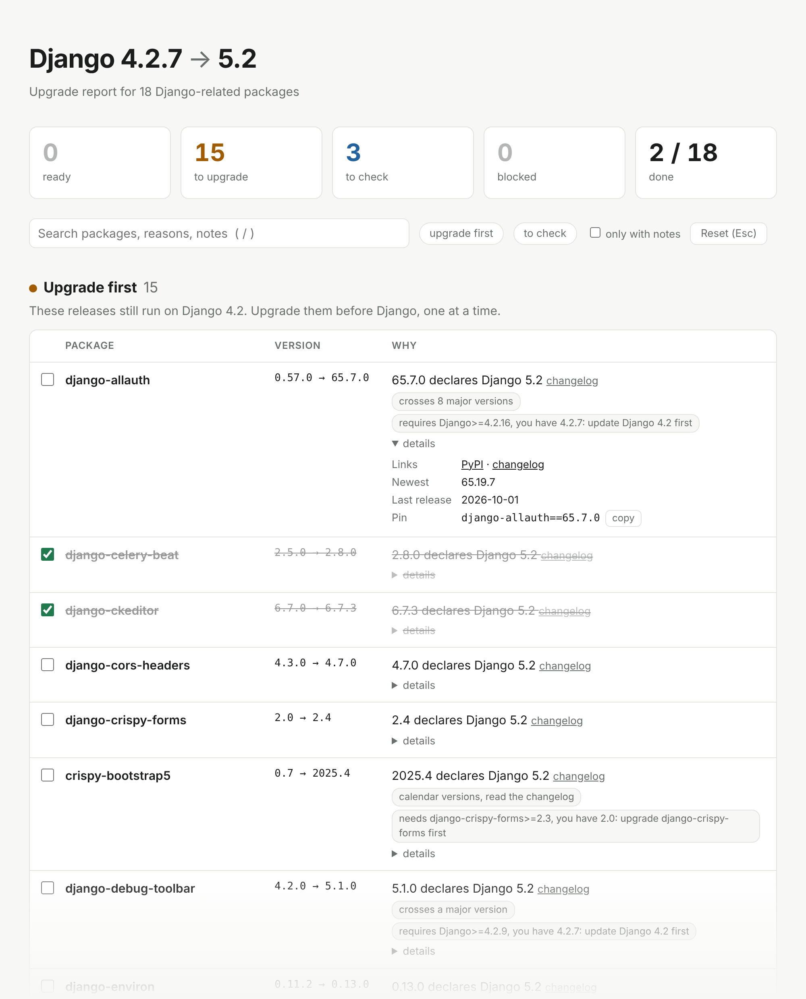
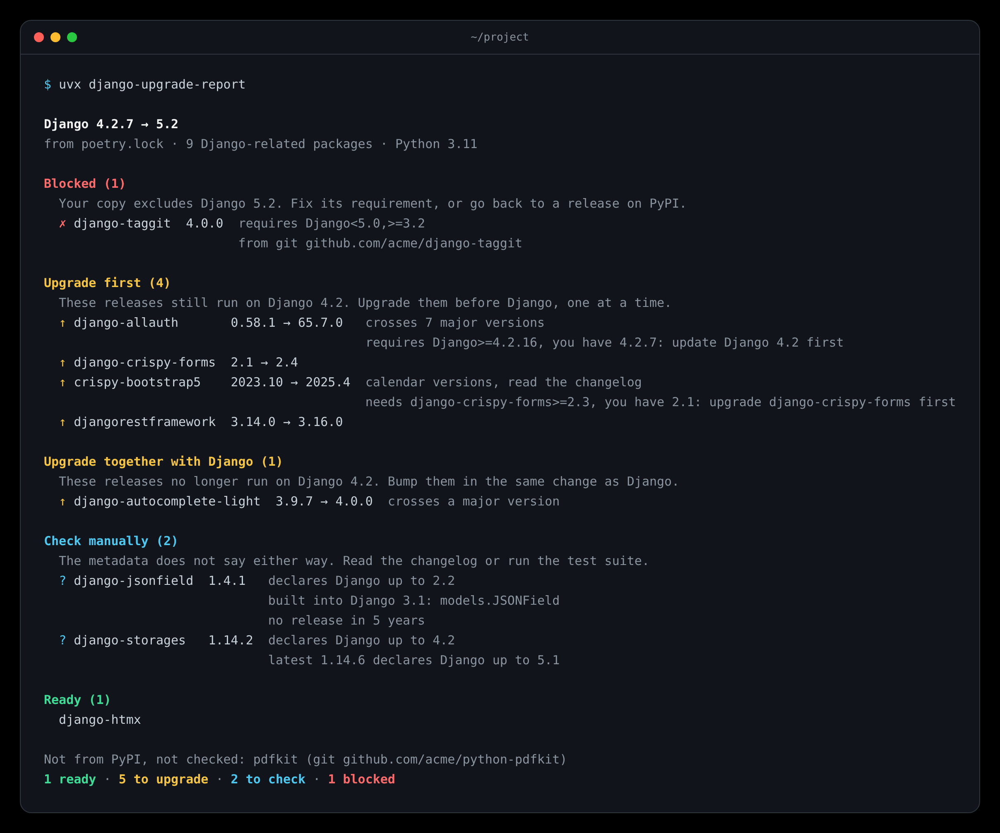
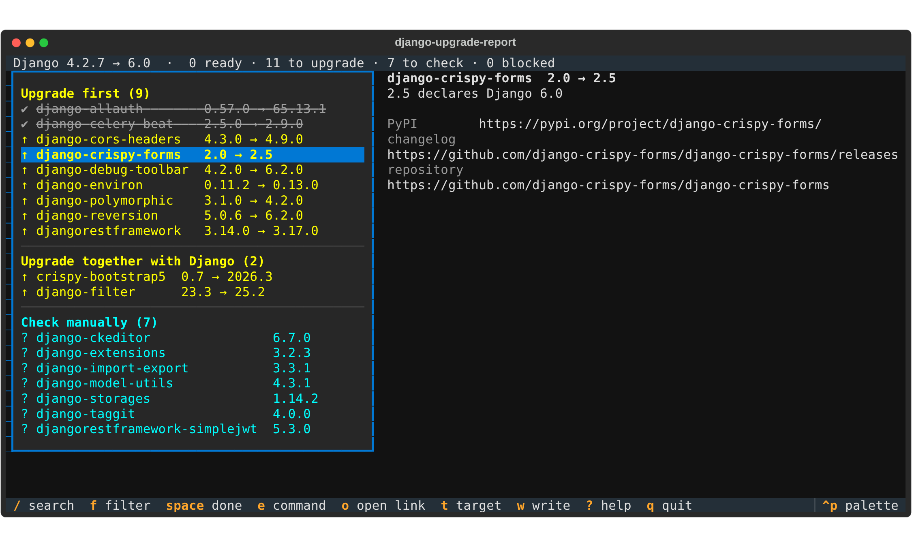

<div align="center">

<a href="https://pushingpixels.at">
  <picture>
    <source media="(prefers-color-scheme: dark)" srcset="docs/assets/logo-dark.svg">
    <source media="(prefers-color-scheme: light)" srcset="docs/assets/logo-light.svg">
    
  </picture>
</a>

<h1>django-upgrade-report</h1>

<p><strong>Which of your dependencies block a Django upgrade, and in which order to upgrade them.</strong></p>

<p>
  <a href="https://github.com/derblub/django-upgrade-report/actions/workflows/ci.yml"></a>
  <a href="https://github.com/derblub/django-upgrade-report/actions/workflows/ci.yml"></a>
  <a href="https://pypi.org/project/django-upgrade-report/"></a>
  <a href="https://pypi.org/project/django-upgrade-report/"></a>
  <a href="https://pypi.org/project/django-upgrade-report/"></a>
  <a href="https://djangopackages.org/packages/p/django-upgrade-report/"></a>
  <a href="https://www.reddit.com/r/django/comments/1wsa9d3/54_days_after_django_61_14_of_the_top_200_django/"></a>
  <a href="LICENSE"></a>
</p>

<p>
  <a href="#quick-start">Quick start</a> ·
  <a href="#what-the-statuses-mean">Statuses</a> ·
  <a href="#usage">Usage</a> ·
  <a href="#in-ci">CI</a> ·
  <a href="#how-it-decides">How it decides</a> ·
  <a href="#faq">FAQ</a> ·
  <a href="CHANGELOG.md">Changelog</a>
</p>

</div>

---

Before you touch Django, you need to know whether the 20 to 200 packages your project depends on are ready for the new version, which of them you can upgrade today, and which have to move together with Django. Finding that out by hand means reading every changelog.

**django-upgrade-report** reads your lockfile, asks PyPI what every Django-related package declares, and gives you the upgrade plan: blockers first, then the smallest safe step for each package, in the right order.

```console
uvx django-upgrade-report
```

<p align="center">
  <picture>
    <source media="(prefers-color-scheme: dark)" srcset="docs/assets/report-dark.png">
    
  </picture>
</p>

## Highlights

- **Knows the order.** Separates upgrades you can ship today, on your current Django, from the ones that have to land in the same change as the Django bump. It also tells you when a release first needs a newer patch of your Django, or a newer version of another package.
- **Smallest step, not latest.** For every package it names the oldest release that declares support for the target, so each change stays small and reviewable.
- **Reads what you already have.** `uv.lock`, `poetry.lock`, `pdm.lock`, `Pipfile.lock`, `requirements*.txt`, `pyproject.toml` or an installed environment, transitive dependencies included.
- **Honest about uncertainty.** A missing classifier means "check manually", not "blocked". An upper bound written before the target was released is not taken as a promise. Packages without a release in two years, or marked inactive, are flagged.
- **Knows your Python.** Finds your project's Python version, warns when the target Django needs a newer one, and evaluates environment markers for your project, not for the machine running the tool.
- **Made for pipelines and for people.** Markdown for pull request summaries, versioned JSON for scripts, a self-contained HTML report to attach to a ticket, and `--fail-on` to break the build.
- **Your code stays put.** Only names and versions of packages that come from PyPI are sent to PyPI. Git, path and private-index packages are listed, never looked up. No account, no configuration.

## Quick start

Run it in your project directory. You need Python 3.10 or newer, but not Django and not your project's virtualenv.

```console
uvx django-upgrade-report                      # with uv
pipx run django-upgrade-report                 # with pipx
pip install django-upgrade-report              # or install it
```

By default it picks the next sensible step for your project: the newest LTS above the Django you run, or the newest release when no LTS is above it. A project on Django 4.2 gets a report for 5.2, a project on 5.2 one for 6.1. Pick another target with `--target`:

```console
django-upgrade-report --target 6.1
```

<p align="center">
  
</p>

To move through a long report instead of scrolling it, open it in the terminal with `-i`: the sections and packages on the left, the chosen package on the right with its notes, signs, command and links. `/` searches, `f` shows one status, `space` ticks a package off, `e` copies its command, `o` opens its changelog, `t` checks another target and `w` writes the report to a file. Ticks are kept in `.django-upgrade-report/state.json` in the project: add it to `.gitignore`, or commit it to share them. It needs the `tui` extra:

<p align="center">
  
</p>

```console
uvx --with textual django-upgrade-report -i
pip install 'django-upgrade-report[tui]'       # or install it with the extra
```

## What the statuses mean

| Status | Meaning | What to do |
| --- | --- | --- |
| **Blocked** | Your release and every newer one exclude the target, for example with `Django<6.1`. | Wait for a release, find a fork or replace the package. |
| **Upgrade first** | A newer release declares the target and still runs on your current Django. | Upgrade these one at a time, before you touch Django. |
| **Upgrade together with Django** | The release that declares the target has dropped your current Django, or needs another package that has. | Bump it in the same change as Django. |
| **Check manually** | Nothing excludes the target, but nothing declares it either. | Read the changelog or run your test suite. Usually a classifier nobody updated. |
| **Ready** | The version you use already declares support. | Nothing. |

The notes on a row tell you more, for example "update Django 4.2 first" when a release needs a newer patch of your current Django, "upgrade django-crispy-forms first" when it needs a newer version of another package you pin, or "newer releases exclude Django 6.1".

An upgrade also says how big the step is, "crosses 2 major versions", counted by the releases in between, where each 0.x minor release counts as a major one. The rows of the Markdown and HTML reports link the package's changelog: the link its maintainers label as such, or its GitHub releases page. The text report shows the links with `-v`.

Some packages did a job Django now does itself, and no metadata says so. For a short list of them the row says what Django has instead, for example "built into Django 1.7: its own migrations, remove South" or "built into Django 3.1: models.JSONField" for django-jsonfield. An entry needs a source, the package's maintainers pointing to Django or Django's release notes; quiet packages, or opinions about a better third-party package, stay out. The list is in [`successors.py`](src/django_upgrade_report/successors.py), and additions with a source are welcome.

## Usage

```console
django-upgrade-report [PROJECT ...] [options]
```

| Option | Description |
| --- | --- |
| `PROJECT` | Project directory, or a single lockfile, requirements file or `pyproject.toml`. Defaults to the current directory. Several make one report with an overview, see [Several projects](#several-projects). |
| `-r`, `--recursive` | Find the projects under `PROJECT`: every directory with a lockfile, requirement files or `pyproject.toml` dependencies. |
| `-t`, `--target` | `auto` (default), `lts` (the newest x.2 release), `latest`, or a version such as `5.2`. See [Choosing the target](#choosing-the-target). |
| `--via` | `lts` or `each`: go to the target in steps, one report per LTS (or per feature version) on the way. See [Choosing the target](#choosing-the-target). |
| `--from VERSION` | The Django version you run today, e.g. `4.2` or `4.2.16`, when your requirements only give a range. `4.2` means the newest 4.2 release. |
| `--python PATH` | Read the exact installed versions from this interpreter, e.g. `.venv/bin/python`. |
| `-f`, `--format` | `text` (default), `markdown`, `json` or `html`. |
| `-o`, `--output` | Write the report to a file instead of stdout. Missing directories are created. |
| `--emit TOOL` | Print the commands that carry out the plan instead of the report, for `uv`, `poetry`, `pdm`, `pipenv` or `pip`; `auto` picks the tool by the lockfile. With `--format json`, they go into the `commands` field. See [Commands to run](#commands-to-run). `renovate` and `dependabot` print a configuration that makes the bot follow the plan. |
| `--static` | With `--format html`: a page without scripts, for places that block scripts in attachments. It has no search, filters or counter of ticks. |
| `--fail-on` | Exit with status 1 when a package is `blocked`, needs an `upgrade` (or is blocked), or needs a `check` (or anything worse). |
| `--baseline REPORT.json` | An earlier `--format json` report: the report starts with what changed since, such as a blocked package that now has a release for the target. |
| `--only-changes` | With `--baseline`: show only what changed, and nothing at all when nothing did. |
| `--fail-on-change` | With `--baseline`: exit with status 1 when `any`thing changed, or when something is `worse` (a status that needs more work, a new package to look at, a new warning). |
| `--python-target` | `auto` (default): also check every dependency on the Python the target Django needs, when your project uses an older one. `none`: never. `3.12` and so on: on that Python, whatever Django needs. See [Upgrading Python too](#upgrading-python-too). |
| `--fail-on-python` | Like `--fail-on`, for the dependencies on that Python. |
| `--no-scan-code` | Do not read your code for dependencies it never uses. |
| `--scan-code DIR` | Read the code in `DIR` for them; the default is the project directory, and nothing when `PROJECT` is a file. |
| `--evidence` | For packages to check, look for signs of support in their GitHub repository: the test matrix on the default branch (tox, nox, GitHub workflows) and the changelog; for blocked packages and ones without a sign, issues and pull requests about the target. Sends the names of those repositories to GitHub. |
| `--explain PACKAGE` | Show step by step how the verdict on a package came about instead of the report: the requirement lines that apply, the classifiers, whether an upper bound counts, every release looked at, and whether it goes before or with Django. Can be given more than once. Paste it into an issue when you think a verdict is wrong. |
| `-v`, `--verbose` | Text output only: list every ready package with its reason. The other formats always do. |
| `-i`, `--interactive` | Move through the report in the terminal instead of printing it. Needs the `tui` extra (`pip install 'django-upgrade-report[tui]'`). Not in CI, and not with `--format`, `-o`, `--fail-on`, `--emit`, `--explain` or `--via`. |
| `-q`, `--quiet` | Text output only: just the headline, warnings, blocked packages and the counts. |
| `--index-url` | Base URL of an index that implements PyPI's JSON API. Default: `https://pypi.org/pypi`. |
| `--check-private-on-pypi` | Look up packages your project installs from another index on PyPI, too. For an index that mirrors PyPI (Artifactory, Nexus, devpi). Their names are sent to PyPI. |
| `--no-cache` | Do not cache PyPI responses. |
| `--offline` | Answer from the cache only, however old, and never ask the package index. A package that is not in the cache counts as not checked. |
| `--prefer-cache` | Answer from the cache, however old, and ask the index only for what is missing. |
| `--no-input` | Never ask in the terminal. Without it, a run at a terminal asks for what the project leaves out and that changes the report: the Django you run when it is not pinned, a smaller first step when the target skips an LTS, and your Python when no file names it. Never in CI, never with `-o`, `--explain` or a format other than text. |
| `--errors-as-warnings` | Exit with status 0 instead of 2 when the report cannot be made, for example offline without a cache. For hooks that must not block a commit. |
| `--version` | Show the version and exit. |

Responses are cached in `~/.cache/django-upgrade-report` (or `$XDG_CACHE_HOME/django-upgrade-report`): a project's release list for 24 hours, the metadata of a single release for good, since it never changes. A new version of the tool may keep more of each answer; it then fetches them once more and ignores the old files, so delete the directory now and then to free the space.

### Exit codes

| Code | Meaning |
| --- | --- |
| `0` | The report was written, and no package matched `--fail-on`. |
| `1` | A package matched `--fail-on`. |
| `2` | An error: no dependencies found, an unreadable file, an unknown target, the index could not be reached. Also with `--fail-on` when no dependency could be checked because they all come from another index. With `--errors-as-warnings` these exit with `0` and print a warning instead. |

So CI can tell "packages need attention" from "the tool could not run".

### Choosing the target

| `--target` | Checks against |
| --- | --- |
| `auto` | The newest LTS above your Django, or the newest release when no LTS is above it. When you already run the newest release, a health check of it. When your Django version is unknown, the newest LTS. |
| `lts` | The newest x.2 release. When your Django is newer, a health check of your version instead. |
| `latest` | The newest release. |
| `5.2`, `6.1`, ... | That feature version. The next, unreleased one (6.2 today) is accepted for planning, see [How it decides](#how-it-decides). Unknown versions and versions below yours are an error. |

The report warns when the target skips an LTS (upgrading one LTS at a time is easier), when your own Django requirement excludes the target, and when the target needs a newer Python than your project uses.

`--via lts` plans the whole way in steps, one report per LTS on the way, `--via each` one per feature version:

```console
$ django-upgrade-report --target 5.2 --via lts
Django 3.2.25 → 4.2 → 5.2 (2 steps)

Step 1 of 2
Django 3.2.25 → 4.2
  ↑ django-filter  21.1 → 23.1  …

Step 2 of 2
Django 4.2.30 → 5.2
  ↑ django-filter  23.1 → 25.1  …
```

Each step starts where the one before ends: its upgrades done, Django on the newest patch of that release. A package blocked in one step says so in the later ones, since the plan stops there. `--fail-on` looks at every step. The JSON report of a path has `"kind": "path"` and one report per step; Markdown folds each step, and the HTML report shows them on one page under an overview, with one checklist for the whole way. It does not go with `--baseline`, `--emit` or `--explain`.

### Where versions come from

The most precise source wins:

| Priority | Source | Versions | Transitive dependencies |
| --- | --- | --- | --- |
| 1 | `--python PATH` | exact, as installed | yes |
| 2 | `uv.lock`, `poetry.lock`, `pdm.lock`, `Pipfile.lock` | exact | yes |
| 3 | `requirements*.txt`, `requirements/*.txt`, `pyproject.toml` | exact when pinned with `==` | no |

Requirement files follow `-r` includes and `-c` constraint files; constraints only pin packages that are listed elsewhere. `pyproject.toml` is read as PEP 621, dependency groups and Poetry. When a lockfile holds several versions of one package for different Pythons, as uv's forked resolutions do, the one for your project's Python is used.

Unpinned requirements are judged by the newest release they allow and marked as such. Use a lockfile for exact results. When Django itself is only given as a range with an upper bound, such as `Django>=4.2,<5.0`, the newest release it allows is assumed and a warning says so. Without an upper bound the report cannot tell what can be upgraded first. In both cases, `--from` sets the version you run.

### Which Python

Environment markers such as `python_version < "3.12"` decide which requirements apply, so the tool needs your project's Python. It takes the first of:

1. the interpreter passed with `--python`,
2. `.python-version`,
3. `requires-python` in `uv.lock`,
4. `requires-python` in `pyproject.toml`,
5. the `python` dependency in Poetry's `pyproject.toml`,
6. `python_version` in `Pipfile.lock`.

A range counts as its lower bound. The report shows the Python it found and warns when the target Django needs a newer one, for example `Django 6.1 needs Python >=3.12, your project uses 3.11 (from .python-version)`.

Markers are evaluated for CPython on Linux, where Django apps are deployed, never for the machine running the tool. Against the target, a package is judged on the newer of your project's Python and the oldest Python the target Django supports. Against your current Django, on your project's Python, or the oldest Python your current Django supports when none was found.

### Upgrading Python too

Django 6.0 needs Python 3.12. When the target Django needs a newer Python than your project uses, the report starts with what your dependencies need on it, all of them, not only the Django-related ones:

```
Python 3.12 first (2)
  These dependencies need something before they run on Python 3.12.
  ↑ numpy            1.22.4 → 1.26.0  1.22.4 no wheel for Python 3.12, pip builds it from source
  ↑ psycopg2-binary  2.9.3 → 2.9.9    2.9.3 no wheel for Python 3.12, pip builds it from source
  3 more dependencies run on Python 3.12, all pure Python.
  1 says nothing about Python versions: pycrypto.
  Django 4.2.7 does not declare Python 3.12, 4.2.8 does: update Django 4.2 first.
```

For each installed release, in this order: a `Requires-Python` that excludes the Python means no; a `Programming Language :: Python :: 3.12` classifier means yes; so does a wheel built for it. An `abi3` wheel for an older Python, or a pure-Python wheel, runs too. Wheels only for other Pythons mean pip builds the package from source, which needs a compiler and often fails; without a source distribution it cannot be installed at all. Wheels count when they install on CPython under Linux on x86_64. A dependency that needs something gets the oldest newer release that runs on the Python, with a note when that release no longer runs on the Python you use today, so it goes together with the switch. It needs a project Python (see above); `--python-target 3.13` checks any Python you name.

### Several projects

For a monorepo or a folder of services, pass several projects, or let `--recursive` find them:

```console
$ django-upgrade-report -r services --target 5.2
3 projects
  services/admin   Django 5.2 · health check  0 ready · 2 to upgrade · 0 to check · 0 blocked
  services/api     Django 4.2.7 → 5.2         30 ready · 5 to upgrade · 1 to check · 2 blocked
  services/worker  Django 4.2.7 → 5.2         12 ready · 3 to upgrade · 0 to check · 1 blocked

Blocking more than one project
  django-taggit  services/api, services/worker

Upgrades several projects share
  django-filter → 25.1  services/admin, services/api, services/worker
```

Each project's report follows, folded in Markdown; the HTML report links each project from the overview. Every project has its own target (`auto` unless you pass `--target`), and a package several projects use is looked up once. `--recursive` skips virtual environments, `node_modules` and hidden directories, and a directory inside a project, such as `requirements/` or a package with its own `pyproject.toml`, belongs to that project unless it has a lockfile of its own. A project that cannot be checked is listed with the reason, the others are still reported, and the run exits with 2. `--fail-on` looks at every project. The JSON report has `"kind": "multi"`, with `projects`, `blocking` and `shared_upgrades`. `-i`, `--emit`, `--explain`, `--via`, `--baseline`, `--python` and `--scan-code` work on one project. In the GitHub Action, `path` takes one project per line, and `recursive: true` finds them.

### Wagtail and django CMS

`--framework wagtail` (or `django-cms`) plans the upgrade of that framework instead of Django's: `--target`, the sections, the commands and the bot configurations are about Wagtail, and only packages that depend on Wagtail or declare `Framework :: Wagtail` are checked. Wagtail's LTS releases come from its [release schedule](https://github.com/wagtail/wagtail/wiki/Release-schedule), so `auto` is the newest of them; django CMS has none, so `auto` is its newest release. The report also says whether the target runs on your Django ("Wagtail 7.0.9 requires Django>=4.2: your Django 4.2.16 is fine"), and when it does not, which Django to upgrade to first. For django CMS, plugins named `djangocms-…` count even when they declare neither django CMS nor its classifiers. The Python plan, `--evidence` and the list of what Django removed stay Django's and are left out. The GitHub Action takes `framework`.

```console
django-upgrade-report --framework wagtail --target 7.0
```

### Commands to run

`--emit uv` (or `poetry`, `pdm`, `pipenv`, `pip`, or `auto` to pick by the lockfile) prints the commands that carry out the plan instead of the report: the upgrades that go first, one command each, then Django with what needs it, in one command; blocked packages and ones to check are named at the end. For pip it says which requirement lines to change. With `--format json` they go into the `commands` field. See [Upgrade commands](docs/wiki/Upgrade-Commands.md).

### Packages not from PyPI

Packages from git, a local path, a URL or a private index are listed as "Not from PyPI, not checked", with where they come from, and their names are never sent to PyPI. This covers `git+https://...`, `-e` and local path lines in requirement files, `name @ url` requirements, git, path and URL sources in lockfiles, `--index-url` and `--no-index` in requirement files, a private default index or `no-index` in uv, Poetry, PDM or Pipenv, and the `PIP_INDEX_URL`, `UV_INDEX_URL`, `UV_DEFAULT_INDEX`, `PIP_NO_INDEX` and `UV_NO_INDEX` environment variables (lockfiles keep the index they record). Credentials in those URLs are removed before anything is shown.

A fork or a local package can still be judged by what it declares itself, without anything being fetched: the installed metadata with `--python`, the `pyproject.toml` of a local directory, or the constraints `poetry.lock` and `pdm.lock` record. A fork someone pinned years ago with `Django<4.1` shows up as blocked, with a note saying where it comes from. Such a package has no other releases to move to, so it is only ever ready, blocked or to check. Its own requirements count, too: a fork that pins `django-filter<23` holds back that upgrade. Packages whose metadata cannot be read, or that have nothing to do with Django, stay under "Not from PyPI, not checked". The dependencies of a fork are checked like any other package when a lockfile or `--python` lists them.

To check packages from a private index, point `--index-url` at its PyPI JSON API. If the index only mirrors PyPI, pass `--check-private-on-pypi` instead. Packages the index does not know at all are listed as "Not on the package index".

## In CI

### GitHub Actions

The action writes the Markdown report to the job summary, exposes the counts as outputs, and can fail the job:

```yaml
- uses: actions/checkout@v7
- uses: derblub/django-upgrade-report@v1
  id: django
  with:
    fail-on: blocked   # optional: blocked, upgrade or check
- run: echo "${{ steps.django.outputs.blocked }} blocked, ${{ steps.django.outputs.upgrade }} to upgrade"
```

| Input | Default | Description |
| --- | --- | --- |
| `path` | `.` | Project directory with a lockfile, `requirements*.txt` or `pyproject.toml`. Several, one per line, make one report with an overview. See [Several projects](#several-projects). |
| `recursive` | `false` | `true` finds the projects under `path`. `via` and `baseline` work on one project and are left out then. |
| `target` | `auto` | `auto`, `lts`, `latest` or a version such as `6.1`. |
| `framework` | `django` | `wagtail` or `django-cms` plans the upgrade of that framework instead. See [Wagtail and django CMS](#wagtail-and-django-cms). |
| `via` | | `lts` or `each`: plan the way to the target in steps, one report per step. The counts are summed over the steps. Does not go with `baseline`. |
| `from` | | The Django version you run today, when your requirements only give a range. Empty reads it from the project. |
| `fail-on` | | `blocked`, `upgrade` or `check`. Empty never fails the step because of a package. |
| `python-target` | `auto` | `auto`, `none` or a version such as `3.12`. |
| `fail-on-python` | | `blocked`, `upgrade` or `check` on that Python. Empty never fails the step because of it. |
| `comment` | `false` | `true` puts the report on the pull request as one comment, updated on every push; `on-change` updates it only when a status or step changed. Needs `permissions: pull-requests: write`. A pull request from a fork gets a read-only token: then the comment is left out, and the job goes on. |
| `issue` | `false` | `true` keeps one open issue per target with the plan as a task list: the ticks stay, what needs nothing any more is ticked off. Needs `permissions: issues: write`. |
| `comment-key` | the path | Tells comments apart when the action runs more than once for one path in a pull request, such as in a matrix. |
| `baseline` | | An earlier JSON report, the `report` output of a previous run. The summary then starts with what changed since. A missing file is skipped. |
| `fail-on-change` | | `any` or `worse`: fail the step when something changed since the baseline. |
| `evidence` | `false` | `true` looks for signs of support for packages to check in their GitHub repositories, see [Signs of support](#how-it-decides). |
| `check-private-on-pypi` | `false` | `true` looks up packages from another index on PyPI, too. |

| Output | Description |
| --- | --- |
| `report` | Path to the JSON report, unique per use of the action. |
| `blocked`, `upgrade`, `check`, `ready` | Number of packages with that status. |
| `python-blocked` | Number of dependencies no release of which runs on the newer Python. `0` when there is none to check. |
| `changes` | Number of changes since the baseline, empty without one. |

The action brings its own Python, runs on Linux and Windows runners, and caches PyPI responses between runs. The summary and the outputs are written before `fail-on` fails the step.

### Every week, with what changed

[`examples/weekly.yml`](examples/weekly.yml) runs the report every Monday and keeps it in the Actions cache for next week. Each summary then starts with what changed, such as a blocked package that has a release for the target now, and the step fails when something needs more attention than before. On the command line, the same is `--baseline last.json`, with `--only-changes` to print nothing in a quiet week.

### pre-commit

```yaml
- repo: https://github.com/derblub/django-upgrade-report
  rev: v1.0.0
  hooks:
    - id: django-upgrade-report
```

The hook runs when a lockfile, a requirements file or `pyproject.toml` changes, and fails the commit when a package blocks the next Django upgrade. It answers from the cache where it can (`--prefer-cache`), shows only what blocks (`--quiet`), and lets the commit through when the report cannot be made (`--errors-as-warnings`). It reads the project at the repository root and runs when one of its files changes. Add `args: [--target, "6.1"]` to check another target.

### GitLab CI

```yaml
django-upgrade-report:
  image: ghcr.io/astral-sh/uv:python3.12-bookworm-slim
  script:
    - uvx django-upgrade-report --format html --output upgrade-report.html
    - uvx django-upgrade-report --fail-on blocked
  artifacts:
    when: always
    paths: [upgrade-report.html]
```

### Anywhere else

```console
django-upgrade-report --format markdown >> "$GITHUB_STEP_SUMMARY"
django-upgrade-report --format json --output upgrade-report.json
```

The JSON report carries a `schema_version`: adding a field keeps it, renaming, removing or retyping one bumps it. The fields are documented in [`render/json.py`](src/django_upgrade_report/render/json.py).

## How it decides

For every release the tool looks at two pieces of metadata that maintainers publish on PyPI: the `Framework :: Django :: X.Y` classifiers and the `Django` requirement. For a target version, in this order:

1. A requirement that excludes every release of the target means **no**. Each patch release counts, so `Django==5.2.17` or `Django>=5.2.3,<5.2.8` allow 5.2. Requirements that only apply to an optional extra are ignored. Lines with environment markers count when they apply to your Python ([see above](#which-python)), and all lines that apply are combined.
2. A `Framework :: Django :: 5.2` classifier means **yes**.
3. An upper bound that allows the target, such as `Django>=4.2,<6.0` or an exact pin, means **yes**, but only when the release was uploaded on or after the day the target came out. A bound written before that is a guess, not a promise: Wagtail 6.3 allows `Django<6.0` but came out before Django 5.2, and only Wagtail 6.3.4 added 5.2 support.
4. Everything else means **not declared**: classifiers that stop at an older version or start at a newer one, a major-only classifier such as `Framework :: Django :: 5`, a lower bound without an upper one, or no information at all. That is a question, not a blocker: classifiers often lag behind releases.

For a target that is not released yet, such as 6.2 today, only classifiers count, and the report says so. An upper bound like `<7.0` says nothing about a version nobody could test.

Pre-releases never decide a status: you cannot pin an `rc` in production. When no stable release declares the target but the newest pre-release does, the row says so, for example "2.6.0.dev22 declares Django 6.1 (pre-release)". For a blocked package it also says when the newest pre-release no longer excludes the target. Only a pre-release newer than every stable release counts, judged by the same rules.

From these verdicts, per package:

- **Ready** when the version you use says yes.
- **Upgrade** when a newer release says yes. The report names the oldest one. It goes **first** when that release still runs on your current Django. A release that needs `Django>=4.2.16` while you run 4.2.7 still goes first, with a note to update Django 4.2 first. It goes **together with Django** when the release excludes your whole Django series, declares only newer Django versions, or needs a newer version of another package you pin that has itself dropped your Django.
- **Check manually** when no release says yes, but yours or a newer one is not excluded.
- **Blocked** when your release and every newer one exclude the target.

A package to check can still show **signs of support**: its README on PyPI naming the target ("README of 2.1 mentions Django 5.2"), for the release the report names or else the newest. With `--evidence`, also its GitHub repository: a test matrix on the default branch that runs the target (tox, nox or a GitHub workflow: "main branch tests Django 6.0 (tox.ini)"), and a changelog section after your version that adds or tests it ("changelog of 1.14.5 mentions Django 5.1 support"). For blocked packages and ones to check without a sign, it also lists up to two issues or pull requests whose title names the target ("open PR: Add Django 5.2 support (#912)"; a merged one means the next release likely has it). Signs are notes, linked to where they come from, and never change a status or `--fail-on`. Packages to check without any sign come first, since that is where the work is.

A direct dependency that your code never names gets the note "not imported or configured in your code: remove it instead?": removing it is often less work than upgrading it. The code in the project directory is read locally, never imported and never sent: imports, dotted paths in strings (`INSTALLED_APPS`, `MIDDLEWARE`, `ENGINE` and the like), app lists, `` in templates and `manage.py` commands in scripts. Anything unsure counts as used: servers and tools you run rather than import, a project with more than 20,000 files, and one without Python code give no note. The end of the report lists every direct dependency the code never names, Django-related or not, as "Possibly unused"; `--explain` says where the code uses a package. With `--python`, the module names come from the environment itself instead of a table. `--no-scan-code` turns it off.

After the packages, the report lists what Django removed on the way to the target, from the "Features removed" sections of its release notes, and which of it your code still uses: "The model's Meta.index_together option is removed  shop/models.py:11 · django-upgrade fixes this". Only the used ones are shown, the rest as a link to the release notes; `-v` shows all. A removal counts as used only when the code names the very thing that is gone: an import, a setting, a `Meta` option, a template filter, a method. Rewriting the code is the job of [django-upgrade](https://github.com/adamchainz/django-upgrade).

A package counts as Django-related when it depends on Django or has a `Framework :: Django` classifier. Packages that only depend on Wagtail or django CMS are included too, with a note to check them against that framework. Everything else is skipped. With `--framework wagtail` the same rules apply to Wagtail, with one difference: Wagtail's classifiers name major versions only (`Framework :: Wagtail :: 6`), so such a classifier means **yes** for 6.3 when the release came out after 6.3 did, and **not declared** before.

> [!NOTE]
> The report shows what maintainers declare, not whether your tests pass. Use it to plan the upgrade, then run [django-upgrade](https://github.com/adamchainz/django-upgrade) on your code and your test suite with `python -W error::DeprecationWarning`.

## FAQ

<details>
<summary><strong>Does it send my code anywhere?</strong></summary>

No. It reads your lockfile or requirement files locally, and your code to find dependencies it never uses (see below), and sends only names and versions of packages that come from PyPI to the package index, PyPI by default. Packages from git, local paths or a private index are never looked up unless you ask for it. It does not import your project and does not need Django installed.

`--evidence` reads files from the public GitHub repositories of packages to check, so GitHub learns the names of those repositories: only of packages from PyPI that name a GitHub repository, never of a package from git, a path or a private index. It also searches their issues through the GitHub API, which allows 10 searches a minute, 30 with `GITHUB_TOKEN` set; with the token it also lists their workflow files.
</details>

<details>
<summary><strong>Why does it say that about my package?</strong></summary>

Run it again with `--explain` and the package's name, for example `django-upgrade-report --explain wagtail`. It shows the Django requirement lines that apply on your Python, the classifiers, whether an upper bound counts given when it was set, every release it looked at with its verdict, and why an upgrade goes before or with Django. If the verdict is still wrong, paste that output into a [wrong verdict](https://github.com/derblub/django-upgrade-report/issues/new/choose) issue.
</details>

<details>
<summary><strong>Why are so many packages "check manually"?</strong></summary>

Many maintainers forget to add the classifier for a new Django version, or only add it with the next release. The tool refuses to guess. Packages that are really incompatible almost always say so with an upper bound, and those show up as blocked. Run with `--evidence` to see which of them test the target on their main branch already.
</details>

<details>
<summary><strong>What about private packages?</strong></summary>

Packages your project installs from git, a path or a private index are never looked up. Forks and local packages are judged by their own metadata when it can be read locally (with `--python`, from a local `pyproject.toml`, `poetry.lock` or `pdm.lock`); the rest are listed as "Not from PyPI, not checked". If your private index implements PyPI's JSON API, point `--index-url` at it. If it mirrors PyPI, pass `--check-private-on-pypi`. See [Packages not from PyPI](#packages-not-from-pypi).
</details>

<details>
<summary><strong>How is this different from Dependabot or Renovate?</strong></summary>

They bump versions one package at a time. They do not know which release is the first one to support the Django version you are heading for, or which upgrades have to wait for Django. Use this tool to plan, and let them open the pull requests.

`--emit renovate` prints `packageRules` that make Renovate follow the plan, `--emit dependabot` the `groups` and `ignore` keys for `.github/dependabot.yml`: Django stays on its series until everything that goes first is upgraded, and Django comes in one pull request with the packages that need it. Each rule says when to remove it.

```console
$ django-upgrade-report --emit dependabot
    groups:
      django-5-2:
        patterns:
          - "django"
          - "django-with"
    ignore:
      # Hold Django at 4.2 until the 'upgrade first' list is done, then remove this.
      - dependency-name: "django"
        versions: [">=5.0"]
```
</details>

<details>
<summary><strong>How is this different from django-upgrade?</strong></summary>

[django-upgrade](https://github.com/adamchainz/django-upgrade) rewrites *your* code for a new Django version. django-upgrade-report looks at your *dependencies*. You want both.
</details>

<details>
<summary><strong>How ready is the Django ecosystem as a whole?</strong></summary>

Every week, a workflow judges the newest release of the 300 most downloaded Django-related packages against every Django version from 4.2 on, plus the next one, with the rules above, and publishes the result to GitHub Pages: per version the share that is ready, to check or blocked, and how fast packages caught up after the release. The code is in [`ecosystem/`](ecosystem/build.py), outside the package: the tool itself never talks to a server of its own. The package list comes from the public [top-pypi-packages](https://github.com/hugovk/top-pypi-packages) data and is checked in, so runs stay comparable.
</details>

## Related projects

| Project | What it does |
| --- | --- |
| [django-upgrade](https://github.com/adamchainz/django-upgrade) | Rewrites your code for new Django versions. |
| [Django Packages readiness](https://djangopackages.org/readiness/) | Shows compatibility per package on the web. |
| [Django's upgrade guide](https://docs.djangoproject.com/en/stable/howto/upgrade-version/) | The official checklist for an upgrade. |

## Contributing

Bug reports with a real lockfile are the most useful contribution. See [CONTRIBUTING.md](CONTRIBUTING.md) for the development setup, and the [Code of Conduct](CODE_OF_CONDUCT.md). Security issues go through [SECURITY.md](SECURITY.md).

## License

[MIT](LICENSE) © Daniel Kurdoghlian, Pushing Pixels

---

<div align="center">
  <a href="https://pushingpixels.at">
    <picture>
      <source media="(prefers-color-scheme: dark)" srcset="docs/assets/pushing-pixels-dark.svg">
      <source media="(prefers-color-scheme: light)" srcset="docs/assets/pushing-pixels-light.svg">
      
    </picture>
  </a>
  <p>Built and maintained by <a href="https://pushingpixels.at">Daniel Kurdoghlian</a> at <a href="https://pushingpixels.at">Pushing Pixels</a> in Vienna.<br>
  Planning a larger upgrade? I do <a href="https://pushingpixels.at/creates/django-upgrades">fixed-price Django upgrade audits</a>.</p>
</div>
