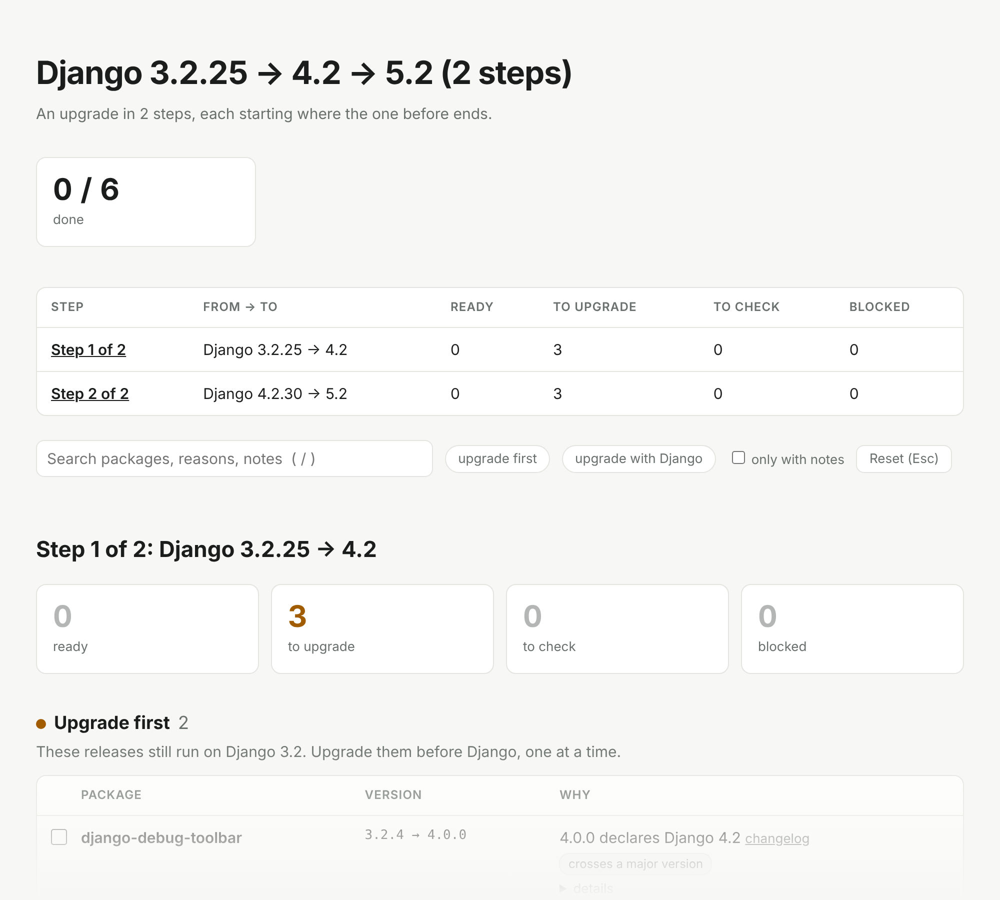

# Getting started

## Install or run

You need Python 3.10 or newer, but neither Django nor your project's virtualenv.

```console
uvx django-upgrade-report                      # with uv, nothing to install
pipx run django-upgrade-report                 # with pipx
pip install django-upgrade-report              # or install it
```

Run it in your project directory, or pass the directory or a single file:

```console
django-upgrade-report                          # the current directory
django-upgrade-report path/to/project
django-upgrade-report requirements/production.txt
```

## Pick the target

By default (`--target auto`) it checks the next sensible step: the newest LTS above the Django you run, or the newest release when no LTS is above it. A project on 4.2 gets a report for 5.2, a project on 5.2 one for 6.1.

```console
django-upgrade-report --target 6.1             # a feature version
django-upgrade-report --target lts             # the newest x.2 release
django-upgrade-report --target latest          # the newest release
```

When the target skips an LTS, the report warns and suggests a smaller first step. Upgrading one LTS at a time is easier. `--via lts` shows the whole way at once: one report per LTS, each starting where the one before ends. In HTML, the steps come on one page under an overview:



## Give it the exact versions

The more precise the source, the more precise the report. A lockfile (`uv.lock`, `poetry.lock`, `pdm.lock`, `Pipfile.lock`) is best. Without one, point it at your environment:

```console
django-upgrade-report --python .venv/bin/python
```

If Django itself is only given as a range, say which version you run with `--from 4.2.16`. At a terminal the tool asks for it instead, and for your Python when no file names it; `--no-input` turns the questions off.

## Read the result


Work from the top: deal with the blockers, upgrade the "first" packages one at a time, then bump Django together with the "together" packages. [Reading the report](Reading-the-Report) explains every section and note.

## In the terminal

`-i` opens the report in the terminal: the sections and packages on the left, the chosen package on the right with its notes, signs of support, the command to upgrade it and its links. The keys:

| Key | What it does |
| --- | --- |
| `↑` `↓` | Choose a package. |
| `/` | Search names, reasons and notes. |
| `f` | Show one status at a time: blocked, to upgrade, to check, ready, then everything again. |
| `space` | Tick the package off, or tick it on again. |
| `e` | Copy the command that upgrades it (through the terminal, so over SSH too, where the terminal allows it). |
| `o` | Open its changelog, else its repository, else its page on PyPI. |
| `t` | Check against another target, such as `6.0` or `latest`. The cache makes it quick. |
| `w` | Write the report to a file; the name says the format: `.html`, `.md`, `.json`, else text. |
| `Esc` | Clear the search and the filter. |
| `?`, `q` | Show the keys, quit. |

Ticks are kept per package and target in `.django-upgrade-report/state.json` in the project, not in the cache: add it to `.gitignore`, or commit it so the team sees them. It needs the `tui` extra, which brings [Textual](https://textual.textualize.io/); the tool itself does not depend on it:


```console
uvx --with textual django-upgrade-report -i
pip install 'django-upgrade-report[tui]'
```

## Other formats

```console
django-upgrade-report --format markdown        # for pull requests and job summaries
django-upgrade-report --format html -o report.html   # one self-contained file to share
django-upgrade-report --format json -o report.json   # for scripts, see the JSON reference
```

## When a verdict surprises you

```console
django-upgrade-report --explain wagtail
```

shows every rule and every release the tool looked at for that package. See [How it decides](How-It-Decides).
