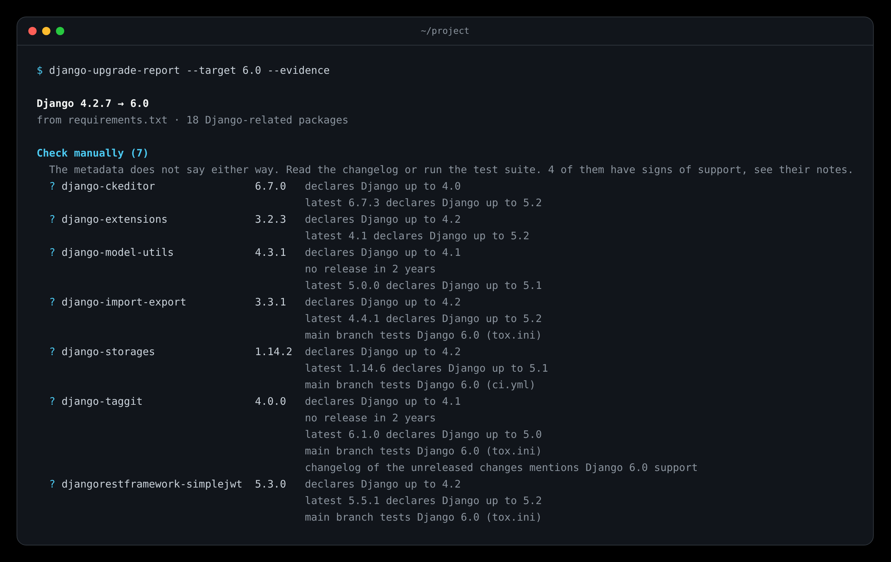
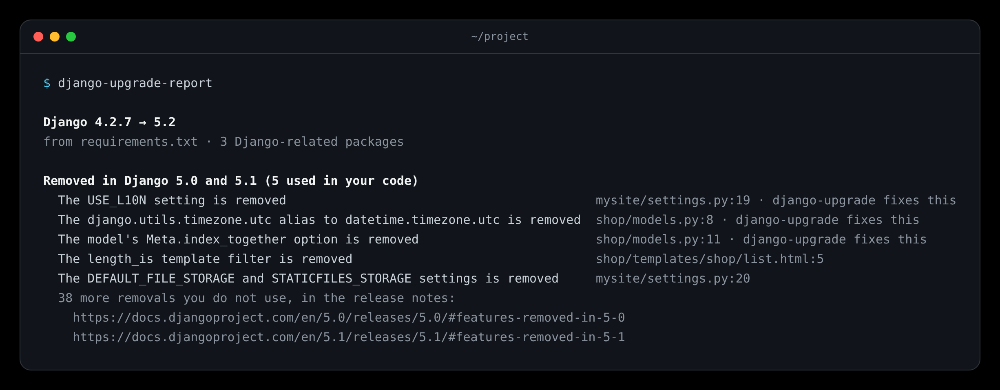

# How it decides

The tool reads what maintainers publish on PyPI, never your code. For every release it looks at the `Framework :: Django :: X.Y` classifiers and the `Django` requirement.

## One release, one Django version

In this order:

1. **A requirement that excludes every release of the target means no.** Each patch release counts, so `Django==5.2.17` or `Django>=5.2.3,<5.2.8` allow 5.2. Requirements that only apply to an optional extra are ignored. Lines with environment markers count when they apply to your Python (see [Dependency sources](Dependency-Sources#which-python)), and all lines that apply are combined.
2. **A `Framework :: Django :: 5.2` classifier means yes.**
3. **An upper bound that allows the target means yes, if it was set after the target came out.** `Django>=4.2,<6.0` or an exact pin counts only when the release was uploaded on or after the day the target was released. A bound written before that is a guess, not a promise: Wagtail 6.3 allows `Django<6.0` but came out before Django 5.2, and only Wagtail 6.3.4 added 5.2 support.
4. **Everything else means not declared:** classifiers that stop at an older version or start at a newer one, a major-only classifier such as `Framework :: Django :: 5`, a lower bound without an upper one, or nothing at all. That is a question, not a blocker: classifiers often lag behind releases.

For a target that is not released yet, only classifiers count, and the report says so.

## One package

- **Ready** when the version you use says yes.
- **Upgrade** when a newer release says yes. The report names the oldest one, found by bisecting the release history, so a long history costs few requests.
  - It goes **first** when that release still runs on your current Django. A release that needs a newer patch of your Django still goes first, with a note to update Django within its series.
  - It goes **together with Django** when the release excludes your whole Django series, declares only newer Django versions, or needs a newer version of another package you pin that has itself dropped your Django.
- **Check manually** when no release says yes, but yours or a newer one is not excluded.
- **Blocked** when your release and every newer one exclude the target.

Then the upgrades are fitted to each other: when another installed package forbids a proposed release, the package moves to "Check manually"; when an upgrade needs another first, it is ordered after it; upgrades that need each other are marked to go in one change.

A package counts as Django-related when it depends on Django or has a `Framework :: Django` classifier. Packages that only depend on Wagtail or django CMS are included too. Everything else is skipped, except for the [Python check](Upgrading-Python).

## Pre-releases

Pre-releases never decide a status: you cannot pin an `rc` in production. For a package to check or a blocked one, the newest pre-release is looked at when it is newer than every stable release and than yours. When it declares the target, the row says so; for a blocked package also when it no longer excludes the target. That is one more request at most per such package.

## Signs of support



A package to check may still show that it works on the target, in places metadata does not cover. The report shows these signs as notes, each linked to its source, and they never change a status or what `--fail-on` does. Within "Check manually", packages without a sign come first, and the section says how many have one.

- **README on PyPI:** the description of the release the report names, or else of the newest release, names the target: "README of 2.1 mentions Django 5.2". It is part of the answer the report already reads, so it costs nothing. Only a version written right after "Django" counts ("Django 5.2", "Django>=5.2"), not one further down a list.
- **Test matrix, with `--evidence`:** the repository named in the package's links on PyPI (GitHub only) runs its tests against the target on its default branch: "main branch tests Django 6.0 (tox.ini)". Read are `tox.ini` (`envlist`, factors such as `dj52` or `django52`, `[gh-actions:env]`), the tox settings in `pyproject.toml`, `@nox.parametrize("django", ...)` in `noxfile.py` (a list, a dict's keys, or a name for one) and the `matrix:` of GitHub workflows (keys that name Django, as a list or one per line; `exclude:` is skipped). The workflow files are guessed (`test.yml`, `tests.yml`, `ci.yml`, `main.yml`, `python-package.yml`), or listed through the API when `GITHUB_TOKEN` is set: at most eight files per package, from `raw.githubusercontent.com`, cached for a day. "main branch" matters: it is about code not yet released. `main` or `latest` is never read as a version.
- **Changelog, with `--evidence`:** the first changelog file found in the repository (the one the project links as its changelog, else `CHANGELOG.md`, `CHANGELOG.rst`, `CHANGES.rst`, `CHANGES.md`, `HISTORY.rst`, `HISTORY.md`, `docs/changelog.rst`, `docs/changes.rst`, `NEWS.rst`) has, in a section for a version after yours or for the unreleased changes, a line that names the target and supporting, adding or testing it: "changelog of 1.14.5 mentions Django 5.1 support". "Django 5.2 and 6.0" counts for both. A line that drops, removes or deprecates never counts, and a changelog without version headings gives no sign. Packages that are not pinned are not looked up here.
- **Issues and pull requests, with `--evidence`:** for blocked packages first, then packages to check without any other sign, the repository's issues are searched for the target in the title. Up to two are shown, open before closed, pull requests before issues, newest first: "open PR: Add Django 5.2 support (#912)", "merged PR: …" (the next release likely has it). Titles come from outside: they are shortened to 80 characters and escaped in Markdown and HTML. GitHub's search allows 10 searches a minute, 30 with `GITHUB_TOKEN`; the report says when it searched for fewer packages than there were, and stops at the first refusal. Answers are cached for six hours.

## Dependencies your code never uses

When `PROJECT` is a directory, the code in it is read, locally and without importing it, for the names of the modules it uses: imports, dotted paths in strings (`INSTALLED_APPS`, `MIDDLEWARE`, `AUTHENTICATION_BACKENDS`, a database `ENGINE`, `REST_FRAMEWORK` and the like, without knowing each setting), every list assigned to a name ending in `APPS`, `` in templates, and `manage.py` commands in `Makefile`, `Procfile`, `Dockerfile`, shell scripts and GitHub workflows. Virtualenvs, `node_modules`, build and cache directories are skipped.

A direct dependency none of whose modules appears gets the note "not imported or configured in your code: remove it instead?", and the end of the report lists all of them, Django-related or not, under "Possibly unused". `--explain PACKAGE` says where the code uses it ("your code uses it: mysite/settings.py:7"). Module names come, with `--python`, from the environment itself (`importlib.metadata.packages_distributions()`, Python 3.10 and newer), else from a table of the packages whose modules are named otherwise (`djangorestframework` → `rest_framework`, `django-filter` → `django_filters`, `pillow` → `PIL`), else from the package name without `django-` or `python-`. The note is never given for a server or tool you run rather than import (gunicorn, pytest plugins, linters), when the project has no Python code, or when it is too big to read whole (20,000 files or 50 MB). A file that cannot be parsed is skipped. It never changes a status. `--no-scan-code` turns it off, `--scan-code DIR` points it at another directory, or at one at all when `PROJECT` is a file.

## What Django removed



The report lists what Django removed in the releases after yours up to the target, one line per entry of "Features removed in X.Y" in Django's release notes, and, when your code was read, where it still uses each: "The model's Meta.index_together option is removed  shop/models.py:11". Only the used ones are shown, the others as a link to the release notes; `-v` shows every one. "django-upgrade fixes this" marks what [django-upgrade](https://github.com/adamchainz/django-upgrade) rewrites.

A removal counts as used only when the code names the very thing that is gone, and only for an entry that says that thing is removed, not one about an argument, a default or a behaviour:

| Kind | Found as |
| --- | --- |
| `django.utils.timezone.utc` | an import of it, or `timezone.utc` after importing the module |
| `USE_L10N` setting | an assignment at module level in a file with "settings" in its path, or `settings.USE_L10N` |
| `Meta.index_together` | an option set in a `class Meta` |
| `length_is` template filter | `|length_is` in a template |
| `HttpRequest.is_ajax()` method | `.is_ajax` anywhere (names as common as `iterator` are not matched) |
| `NullBooleanField` model field | `models.NullBooleanField` or an import of it, not in migrations |

The list is kept in `src/django_upgrade_report/data/django_removals.json`, made by `scripts/django_removals.py` from Django's release notes once per Django release.

## Packages Django took over

Some packages did a job Django now does itself, and no metadata says so: South, django-jsonfield, django-secure and a few more. Their rows say what Django has instead. Every entry in [`successors.py`](https://github.com/derblub/django-upgrade-report/blob/main/src/django_upgrade_report/successors.py) needs a source: the package's maintainers pointing to Django, or Django's release notes.

## Wagtail and django CMS

With `--framework wagtail` or `--framework django-cms` the same rules apply to that framework: its `Framework :: Wagtail` or `Framework :: Django CMS` classifiers, its requirement in `Requires-Dist`, and only packages that depend on it. One rule differs for Wagtail, whose classifiers name major versions only. `Framework :: Wagtail :: 6` means **yes** for 6.3 when the release came out after Wagtail 6.3 did; before that, it is **not declared**, since nobody could have tested 6.3 yet.

`auto` picks the newest Wagtail LTS ([release schedule](https://github.com/wagtail/wagtail/wiki/Release-schedule)), and the newest django CMS release, which has no LTS. Packages Django took over, the Python plan, `--evidence` and what Django removed are about Django and are left out.

## Seeing it for one package

```console
django-upgrade-report --explain wagtail
```

```text
wagtail against Django 5.2 · django-upgrade-report 0.x
Inputs
  wagtail 6.3 (pinned), from requirements.txt
  your Django 4.2.7
  against Django 5.2, markers on Python 3.10
Your release
  requirement: Django<6.0,>=4.2: allows Django 5.2
  classifiers: Django 4.2, 5.0, 5.1: does not include 5.2
  upper bound: uploaded 2024-11-01, Django 5.2 came out 2025-04-02: set before it, does not count
  verdict: likely: allows Django<6.0,>=4.2, released before 5.2
Releases looked at (10)
  7.0 (2025-05-06): yes, declares Django 5.2
  6.3.4 (2025-04-24): yes, allows Django<6.0,>=4.2
  6.3.3 (2025-02-03): likely, allows Django<6.0,>=4.2, released before 5.2
  ...
Before or with Django
  6.3.4 on your Django 4.2.7: yes, declares Django 4.2 → before Django
Result
  upgrade to 6.3.4 first, before Django: 6.3.4 allows Django<6.0,>=4.2
```

It also explains packages the report leaves out, such as one skipped as not Django-related. The last step of "Your release" is the verdict of the rules above itself, so an explanation can never disagree with the report. Paste it into a [wrong verdict issue](https://github.com/derblub/django-upgrade-report/issues/new/choose) when you still think it is wrong.
