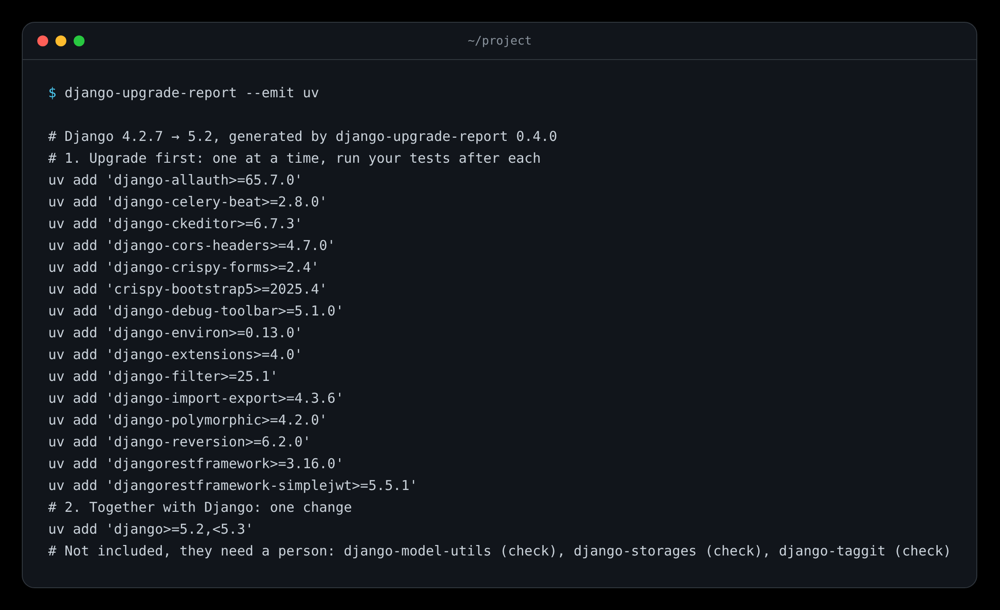

# Upgrade commands

`--emit` prints the commands that carry out the plan instead of the report, for the tool that manages your project:



```console
$ django-upgrade-report --emit uv
# Django 4.2.7 → 5.2, generated by django-upgrade-report
# 1. Upgrade first: one at a time, run your tests after each
uv add 'django-filter>=23.2'
uv lock --upgrade-package django-js-asset==3.0.0
# 2. Together with Django: one change
uv add 'django>=5.2,<5.3' 'django-with>=3.0'
# Not included, they need a person: django-taggit (blocked), django-lagging (check)
```

The steps follow the report. When the target Django needs a newer Python than your project uses, step 0 upgrades what needs it, says whether your Django patch release declares that Python, and ends with the switch ([Upgrading Python](Upgrading-Python)). What can be upgraded before Django comes first, one package per command, in the order of the report, so you can run your tests after each. Packages that need each other ("upgrade together with …") share one command. Then Django and what needs the new Django, in one command. Each package moves to the oldest release that supports the target: `>=` that release, so the tool may pick a newer one. Packages to check, blocked packages and packages not from PyPI are named at the end: they need a person.

## Tools

`--emit auto` picks the tool by the file the report was made from: `uv.lock`, `poetry.lock`, `pdm.lock`, `Pipfile.lock`, or `pip` for requirement files and `--python`. With only a `pyproject.toml`, name the tool.

| Tool | A dependency you name | One that comes with another | Django |
| --- | --- | --- | --- |
| `uv` | `uv add 'p>=v'` | `uv lock --upgrade-package p==v` | `uv add 'django>=5.2,<5.3'` |
| `poetry` | `poetry add 'p@>=v'` | `poetry update p` | `poetry add 'django@~5.2'` |
| `pdm` | `pdm add 'p>=v'` | `pdm update p` | `pdm add 'django~=5.2.0'` |
| `pipenv` | `pipenv install 'p>=v'` | `pipenv update p` | `pipenv install 'django~=5.2.0'` |
| `pip` | the line to change, `# requirements/base.txt:12  p==1.0  →  p==2.0` | a line for a constraints file | `# requirements.txt:1  Django==4.2.7  →  Django~=5.2.0` |

pip has no command that changes a requirement file safely, so for pip the lines are comments that say what to change, and where: the file and line that pin the package, which is the constraints file when a `-c` file pins it. Whether a package is one you name or one that comes with another is read from the project, see [Dependency sources](Dependency-Sources#direct-or-not); when the project does not say, every package is treated as one you name.

## Renovate and Dependabot

The bots that open pull requests bump one package at a time and know nothing of the plan. `--emit renovate` prints `packageRules` for `renovate.json`, `--emit dependabot` the keys to add to the pip entry of `.github/dependabot.yml`:

- **Hold Django** on the series you run (`allowedVersions: "<5.0"`, or an `ignore` for `>=5.0`) while there is anything to upgrade first. Remove it when that list is done.
- **One pull request for Django** and the packages that go together with it (`groupName`, `groups`), and one for upgrades that need each other.
- For Renovate, **no waiting** for the packages to upgrade first (`minimumReleaseAge: "0 days"`).

A plan with nothing to hold or group prints no rules. Both go with the text output only, not with `--format json`.

## In scripts and the HTML report

With `--format json`, `--emit` keeps the JSON report and fills its `commands` field: the tool, the steps with their phase and commands, and what was left out ([JSON report](JSON-Report-Reference)). The HTML report shows each package's command in its details, with a copy button, when the tool is clear from the source.
